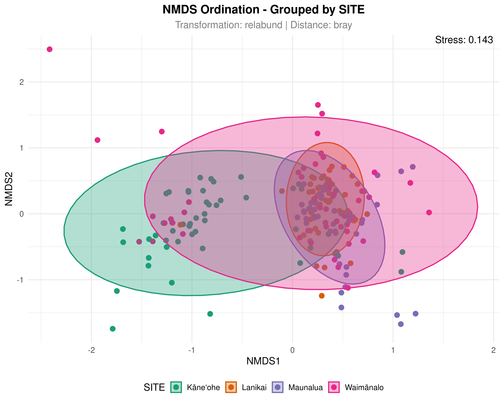

# NMDS: No More Dimensional Stress

> [!IMPORTANT]
> **Preliminary data analysis tool, subject to ongoing development. Results should be interpreted with appropriate caution and validated with statistical rigor.**

## Live Application

Click the image below to launch the interactive NMDS ordination tool:

)

## Background

Non-metric Multidimensional Scaling (NMDS) is a powerful ordination technique widely used in community ecology to visualize patterns of similarity between samples based on species composition. Unlike methods that assume linear relationships, NMDS rank-transforms distances, making it particularly well-suited for ecological data where species responses to environmental gradients are often non-linear.

This interactive tool democratizes NMDS analysis by providing an intuitive interface for exploring how different data transformations and distance measures affect ordination results.

## About the Application

This interactive visualization tool enables researchers to perform NMDS ordination on community composition data (e.g., OTU tables, species abundances) with:

- Multiple data transformation options
- Various distance/dissimilarity measures
- Interactive visualization with confidence ellipses
- Diagnostic tools for assessing ordination quality
- Publication-quality figure export

### Key Concepts

- **OTU (Operational Taxonomic Unit)**: A DNA sequence cluster used as a proxy for a species
- **NMDS Ordination**: A method that represents samples in reduced-dimensional space while preserving rank-order relationships in community dissimilarity
- **Stress**: A measure of how well the NMDS represents the original distances (lower values = better fit)
- **Shepard Plot**: A diagnostic plot showing original distances vs. ordination distances
- **Transformation**: Mathematical adjustments to species abundance data before analysis
- **Dissimilarity Measure**: A metric quantifying how different two samples are in species composition

## Features

### 1. Data Upload
Upload your own OTU table and metadata files (CSV format). The app automatically validates sample matching and provides detailed feedback on data structure.

### 2. Transformation Methods
Choose from a comprehensive suite of ecological transformations:

| Method | Description | When to Use |
|--------|-------------|-------------|
| None | Raw count data | When data is already appropriately scaled |
| Wisconsin | Double standardization (species max → sample total) | Reduces effects of dominant species |
| Hellinger | Square root of relative abundance | Beta diversity analysis, reduces rare species weight |
| Presence-Absence | Convert to 0/1 data | Species occurrence data, automatically uses Jaccard |
| Chi-square | Row and column standardization | Correspondence analysis preparation |
| Log | log1p transformation (log(1+x)) | Reduces skewness in abundance data |
| Relative abundance | Proportions (divide by sample total) | Removes sequencing depth effects |
| Square root | sqrt transformation | Moderately reduces abundant species impact |
| Standardize | Z-score standardization | Comparing across different scales |

### 3. Distance Measures
Select from 12 different dissimilarity measures:

- **Bray-Curtis** - Most common for community data
- **Jaccard** - For presence-absence data  
- **Euclidean** - Straight-line distance
- **Manhattan** - City-block distance
- **Canberra** - Sensitive to near-zero values
- **Binary** - Presence-absence based
- **Chord** - Euclidean after Hellinger
- **Horn** - Morisita-Horn index
- **Kulczynski** - Less sensitive to rare species
- **Gower** - Handles mixed data types
- **Raup-Crick** - Probabilistic measure

### 4. Interactive Visualization
- **NMDS Plot**: Samples displayed in reduced-dimensional space
- **Filled Confidence Ellipses**: 95% confidence regions for groups (requires ≥3 samples per group)
- **Color Palettes**: Multiple Brewer palettes for publication-ready figures
- **Stress Display**: Real-time stress value shown on plot

### 5. Diagnostic Tools
- **Shepard Plot**: Assess ordination quality by comparing original vs. ordination distances
- **Stress Value**: Quantitative measure of fit with color-coded interpretation
- **NMDS Summary**: Detailed output including convergence and iteration information

### 6. Export Options
- Download plots as PDF (vector) or PNG (raster)
- Publication-quality figures with customizable dimensions
- Filename includes transformation and distance method for easy tracking

## Interpreting Your Results

### Stress Values
| Stress Range | Interpretation |
|--------------|----------------|
| < 0.05 | Excellent representation (like a perfect map) |
| 0.05 - 0.10 | Good representation |
| 0.10 - 0.20 | Fair representation (still usable) |
| > 0.20 | Poor representation (results may be misleading) |

### Shepard Plot
- Points following the diagonal line = good fit
- Points scattered widely = poor fit
- The red line shows the overall trend

### NMDS Plot
- Points close together = similar communities
- Points far apart = different communities
- Overlapping ellipses = no significant difference between groups
- Non-overlapping ellipses = potentially different community composition

## Important Considerations

When interpreting NMDS results, please note:

- **Stress is a diagnostic, not a hypothesis test** - Low stress doesn't guarantee biological meaning, just good representation of dissimilarities
- **NMDS is sensitive to random starts** - The app uses multiple random starts (`try = 20`, `trymax = 100`) to find global optimum
- **Sample size matters** - Confidence ellipses require at least 3 samples per group
- **Transformation choice affects results** - Different transformations emphasize different aspects of community structure
- **Ordination is exploratory** - Use results to generate hypotheses, not confirm them

## Data Format Requirements

### OTU Table (CSV)
- First column: OTU IDs (must be unique)
- Other columns: Samples as column names
- Values: Numeric counts or abundances

### Metadata (CSV)
- First column: Sample IDs (must match OTU table column names)
- Other columns: Grouping variables, treatments, etc.
- All grouping variables automatically converted to factors

## Technical Notes

Built with R Shiny, this interactive tool leverages:
- **vegan**: Core NMDS calculations and ecological transformations
- **ggplot2**: Publication-quality visualizations
- **DT**: Interactive data tables
- **shinycssloaders**: Visual feedback during computation

The app implements best practices for NMDS including multiple random starts, appropriate data transformations, and comprehensive diagnostics.

## Troubleshooting Common Issues

| Issue | Solution |
|-------|----------|
| High stress (>0.2) | Increase dimensions (k), remove rare species, try different transformation |
| No matching samples | Check sample names in OTU columns vs. metadata first column |
| NMDS fails to converge | Increase Random starts or Max iterations in settings |
| Ellipses not showing | Groups need ≥3 samples to draw confidence ellipses |
| File too large | Subset data, <200 MB |

## Maintainer

**Patrick Nichols**  
Postdoctoral Researcher  
Biodiversity Genomics Research Group  
University of Oulu  
📧 patrick.nichols@oulu.fi  
🔗 https://biodiversitygenomics.org/

## Acknowledgments

- Jari Oksanen and contributors for the vegan package
- R Shiny development team
